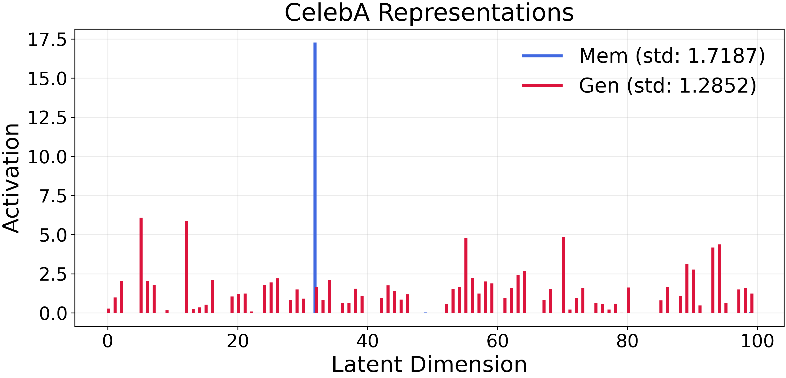
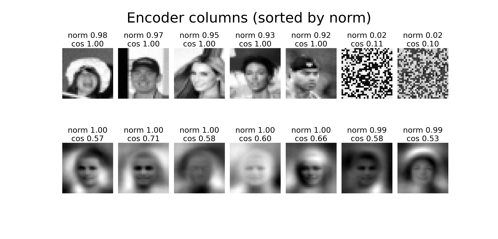
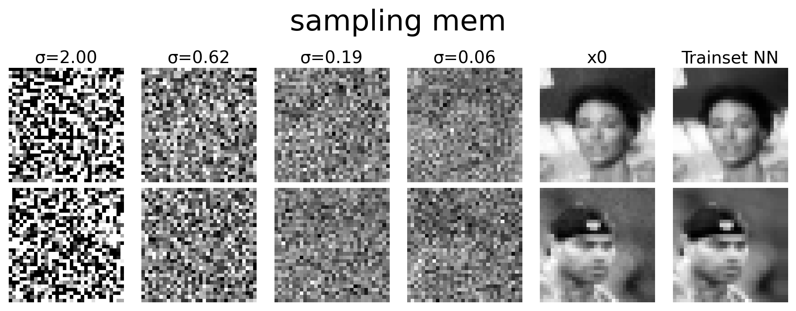
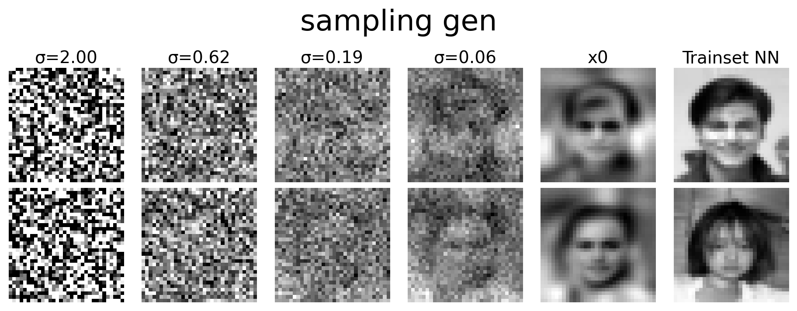
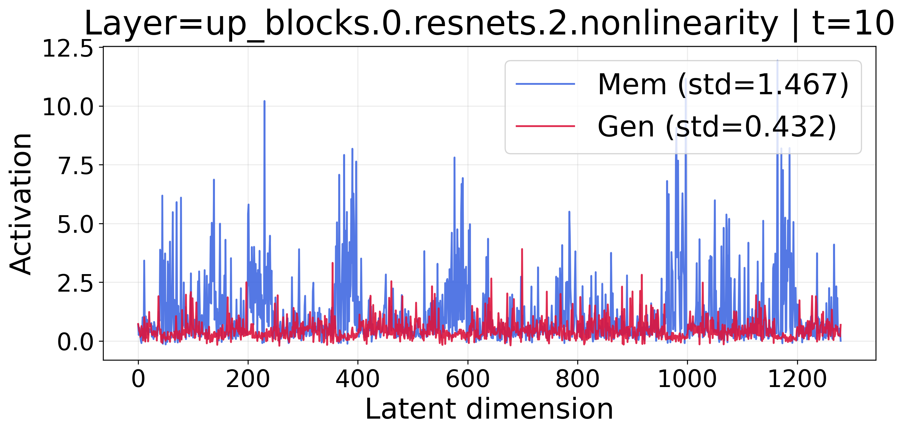
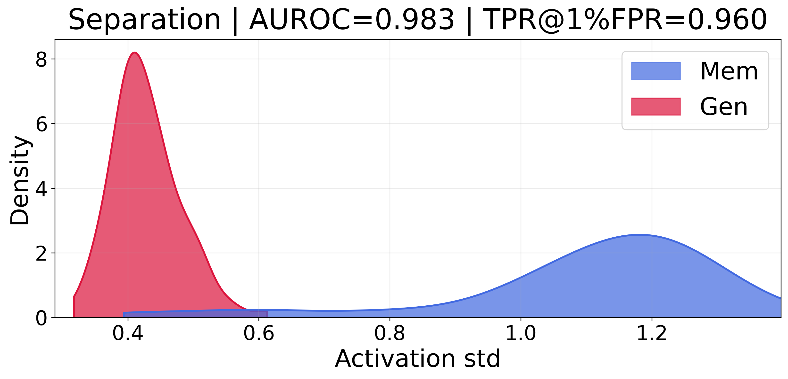
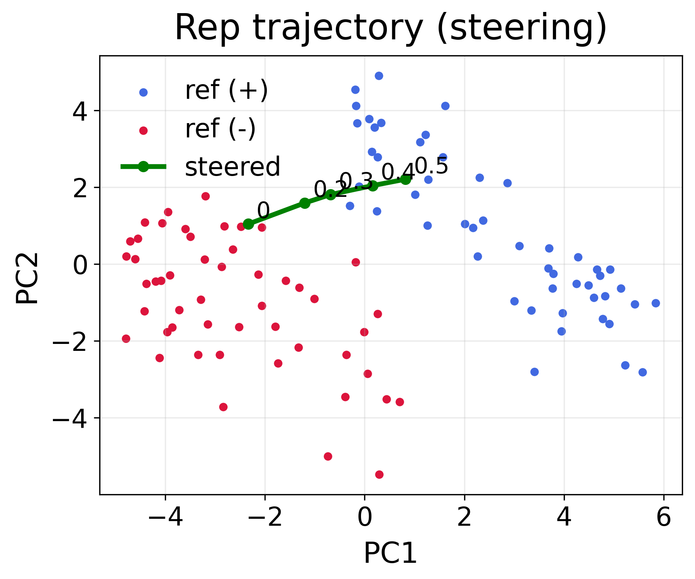

# Generalization of Diffusion Models Arises with a Balanced Representation Space

<p align="center">
  <a href="https://arxiv.org/abs/2512.20963"></a>
  <a href="https://la0ka1.github.io/Diffusion_Rep_Gen_test/"></a>
  <a href="https://alphaxiv.org/abs/2512.20963"></a>
  <a href="https://openreview.net/forum?id=57THeGgNAN"></a>
  </a>
</p>

Code and figures for the ICLR 2026 paper
[**Generalization of Diffusion Models Arises with a Balanced Representation Space**](https://www.alphaxiv.org/abs/2512.20963).

<p align="center">
  
</p>

## At a glance
- `1-Theory/` (CPU): ReLU-DAE analysis + diffusion extension.
- `2-Application/` (GPU recommended): SD v1.4 + LAION representations and steering.
- `Figs/`: plots are saved automatically when you run the notebooks, displayed in this preview.

## Quickstart
```bash
pip install numpy torch torchvision diffusers transformers accelerate datasets scikit-learn pillow tqdm matplotlib seaborn
```


## 1-Theory (CPU)
Notebooks: [`ReLU_DAE.ipynb`](1-Theory/ReLU_DAE.ipynb), [`ReLU_Diffusion.ipynb`](1-Theory/ReLU_Diffusion.ipynb)

ReLU-DAE on CelebA: representations and weights for memorization vs generalization (Figures 4-5).

<p align="center">
  <a href="Figs/celeba_rep.png"></a>
  <a href="Figs/celeba_weights.png"></a>
</p>

Time-conditioned diffusion extension under the same toy setup.
<p align="center">
  <a href="Figs/celeba_sampling_mem.png"></a>
  <a href="Figs/celeba_sampling_gen.png"></a>
</p>

## 2-Application (GPU recommended)
Notebooks: [`SD_compare_reps.ipynb`](2-Application/SD_compare_reps.ipynb), [`SD_steering.ipynb`](2-Application/SD_steering.ipynb)

Stable Diffusion v1.4 + LAION representation structure and separation (Figure 6a/6b).

<p align="center">
  <a href="Figs/laion_reps.png"></a>
  <a href="Figs/laion_separation.png"></a>
</p>

Representation steering: generalization vs memorization (Figure 8).

<p align="center">
  <a href="Figs/laion_steering_gen.png"></a>
  <a href="Figs/laion_steering_mem.png"></a>
</p>

## Extra figure
Steering trajectory in representation space, showing separation between concepts/styles and how steering transfers:
<p align="center">
  <a href="Figs/laion_rep_traj.png"></a>
</p>


## Citation
```bibtex
@inproceedings{zhang2026balanceddiffusion,
  title={Generalization of Diffusion Models Arises with a Balanced Representation Space},
  author={Zhang, Zekai and Li, Xiao and Li, Xiang and Shi, Lianghe and Wu, Meng and Tao, Molei and Qu, Qing},
  booktitle={ICLR},
  year={2026}
}
```
